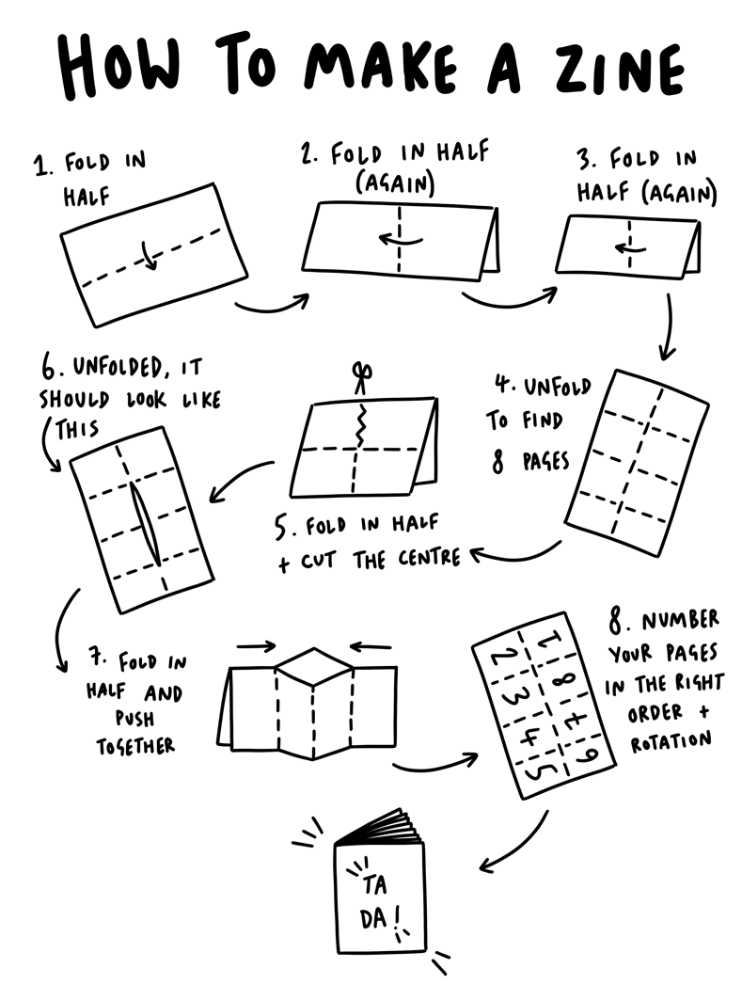
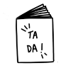

# Zine Editor

<!--
<style>
  .page{
    font-family:sans-serif;
    &.page1 .content{
      display:flex;
      flex-direction: column;
      height: 100%;
      justify-content: space-evenly;
      text-align:center;
      font-family:Consolas;
    }
    blockquote{
      margin-left:0mm;
      border-left:1mm solid silver;
      padding-left:2mm;
    }
    p:has(img.center){text-align: center;}
    a{text-decoration:none;}
  }
  @media print{
    .page{
      a{color:inherit;}
    }
  }
</style>
-->

Ein  
Markdown/Browser  
basierter Zine Generator



## Markdown und HTML

Erstelle eine Markdowndatei und füge sie dieser Seite hinzu.
Es wird in HTML umgwandelt und von deinem Browser hier angezeigt.

Schreibe Text. Benutze Bilder. Lass deiner Fantasie freien Lauf.
Solange dein Browser es anzeigen kann, kannst du es einsetzen.

Jede Seite des Zine ist ein Kapitel in der Markdowndatei.
Die Überschriften werden als Seitentitel verwendet. Du kannst
sie aber auch leer lassen.


## Lokaler Webserver

Nutzt du den Editor offline funktioniert er am besten mit einem
lokalen Webserver. Jeder Server, der statische Dateien versenden
kann ist ausreichend. Bei z.B. Python, PHP
oder Java (18+) sind entsprechende Hilfsmittel dabei.

> Ohne Webserver kannst du auch die `index.hmtl` direkt bearbeiten.
> Suche den `id="zinecontent"` Eintrag und schreibe dort den
> Markdowninhalt hinein.

## Eigene Stile

Es wird CSS verwendet um die Seiten des Zine zu "platzieren"
und zu "skalieren". Einige Stile können für das eigene Layer
genutzt werden.

Trage eigene Stile in die Markdowndatei ein.
Einfach ein `<style></style>` Paar einfügen. Eine gute Stelle
hierfür in nach der allerersten Überschrift.

> Umschließe die Stile mit HTML Kommentaren
> um sie in Markdown Prozessoren zu verstecken.

## Editorstile

`.page`
: Klasse für jede Seite

`.page1`
: Die Titleseite

`.page8`
: Die Rückseite

`.content`
: Der Block in `.page` mit dem generierten HTML.

```css
.page {
  &.page1 .content {
    text-align: center;
    display: flex;
    flex-direction: column;
    justify-content: space-evenly
  }
}
```


## Bilder

Bilder werden automatisch in der Breite angepasst.

Dieses Tool nutzt die Markdown "title" der Bilder um CSS Klassen zu "simulieren".
Diese Klasse können die Größe genauer beschreiben.

Mit `width50` wird die Größe auf 50% der Seitenbreite beschränkt.
Weiter Größen sind `25`, `33`, `50`, `66` oder `75`.

Nutze "Eigene Stile" für noch mehr "Bildbearbeitung".

## Drucken

Dein Zine kann auf DIN/ISO A4 oder US Letter Papier gedruckt werden.
Wähle dein gewünschtes Format im Kopf des Editors aus.

Drucke einfach aus dem Browser heraus aus. Wähle die richtige Papiergröße
und stelle auf "Ohne Rand drucken" um.

Die meisten Browser haben eine "Als PDF speichern" Funktion.
Eine größartige Möglichkeit dein Zine in der Welt zu verteilen.

## Zine editor

&copy; 2025, Nigjo Iqn

Lizenz: Apache 2.0

Quellen:  
`https://github.com/nigjo/zine-editor/`

markdown-it, MIT Lizenz  
`https://github.com/markdown-it/`

Titelbild von
[Daisy Wakefield](https://www.42ndstreet.org.uk/support/read/how-to-make-your-own-zine/)


